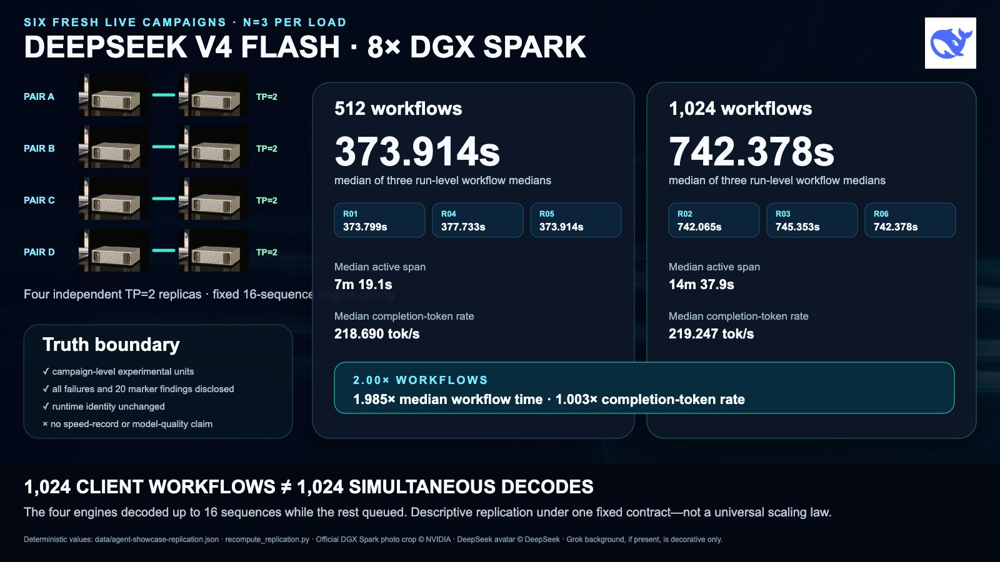
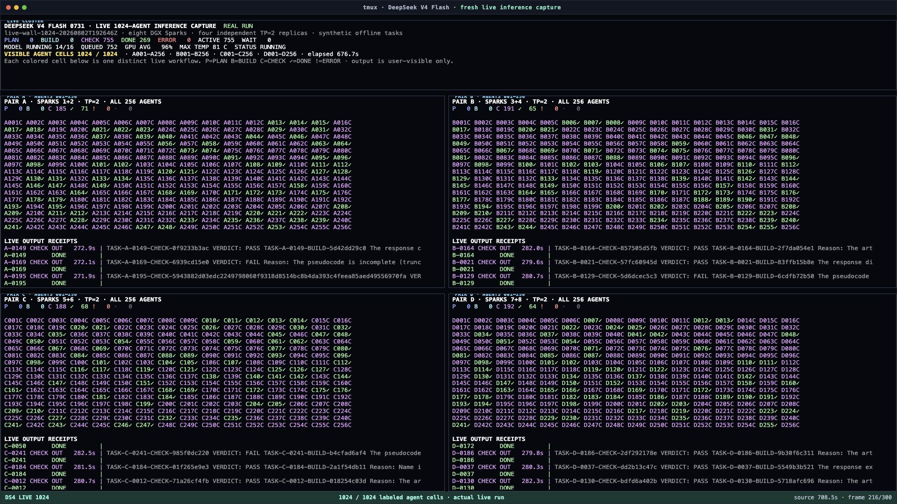

# DeepSeek V4 Flash 0731 on Eight DGX Sparks


*Photo-based cluster graphic. It uses an official NVIDIA DGX Spark product-photo
crop, repeated eight times as a visual depiction of four two-Spark pairs, with
simple connectors between each pair. There is no desktop or monitor in the
graphic. The source is [courtesy of NVIDIA](https://www.nvidia.com/en-us/products/workstations/dgx-spark/),
and the whale comes from DeepSeek's official GitHub avatar. This is a visual
summary, not physical-topology evidence.*

I loaded `deepseek-ai/DeepSeek-V4-Flash-0731` across all eight of my NVIDIA
DGX Spark systems. One replica needs two Sparks, so I split the cluster into
four independent tensor-parallel pairs and ran all four pairs at the same time.

This repository is where I am keeping the whole project: the first frozen
measurements, the exact method, the failures, the changes, and every
optimization that earns its way into a new measured profile.

The first result is a **frozen pre-optimization starting profile, not a record
claim**. That distinction matters. I wanted a clean starting line before I
began tuning the four pairs in different ways.

## I did not trust the first 512-to-1,024 result

The first visual runs looked almost too neat: double the workflows and roughly
double the time. I did not want to defend that from one run on X, so I froze a
new six-run order before collecting the replacement result:

```text
512, 1024, 1024, 512, 512, 1024
```

All six were fresh live inference campaigns across the same four TP=2
replicas. The experimental unit is one complete four-pair campaign—not each
agent inside it. That gives `n=3` per load.



| Replicated result | 512 workflows | 1,024 workflows | 1,024 / 512 |
|---|---:|---:|---:|
| Median of three run-level workflow medians | 373.914 s | 742.378 s | 1.985424x |
| Range of run-level workflow medians | 373.799–377.733 s | 742.065–745.353 s | — |
| Run-level median CV | 0.596810% | 0.244165% | — |
| Median active span | 439.067 s | 877.937 s | 1.999551x |
| Median completion-token rate | 218.690 tok/s | 219.247 tok/s | 1.002549x |

Across the six eligible campaigns, **4,608 of 4,608 workflows** and **13,824 of
13,824 model calls** completed with zero failed workflows. The four engines
still ran no more than 16 model sequences at once. The application-side
high-water marks were 512 or 1,024 client workflows; the engine queues reached
496 or 1,008 waiting requests.

So yes: under this one fixed saturated setup, doubling the client workflows
almost exactly doubled workflow time and active span while completion-token
rate stayed nearly flat. That is a descriptive replication result. It is not a
speed record, a confidence interval, a universal scaling law, or a claim that
1,024 sequences decoded simultaneously.

Twenty responses missed the unique marker gate. They were HTTP 200,
expected-model, nonempty outputs, but I am not relabeling that as perfect
instruction following. The public record also discloses a pre-work import
failure and a later campaign that the frozen collector gate interrupted and
excluded as a whole.

The earlier tmux wall is still useful for showing the original live workflow
motion:



It is not footage of the six replacement campaigns. See the full
[agent concurrency record](docs/AGENT-CONCURRENCY-SHOWCASE.md) for the original
visual-run evidence, the separate replication protocol, run-level values,
failure disposition, exact limits, and media hashes.

## First measured profile

Each value is the median of three independent repetitions. Every repetition
contains 20 measured requests after four excluded warmups.

| Anonymous pair | c1 output tok/s | c1 TPOT ms | c4 output tok/s | c4 TPOT ms |
|---|---:|---:|---:|---:|
| A | 21.1470 | 38.2088 | 39.3938 | 83.8383 |
| B | 20.8370 | 38.0440 | 39.0501 | 84.8422 |
| C | 21.0258 | 38.1040 | 39.5904 | 83.1218 |
| D | 21.2443 | 37.8461 | 39.5439 | 84.5273 |

The median of the repetition-wise four-pair sums was **84.4107 output tok/s
at c1** and **158.2688 output tok/s at c4**.

What stands out to me is the balance across the cluster:

- all **480 of 480** official measured requests completed;
- every official request recorded exactly 2,048 input tokens and 128 output
  tokens;
- pair spread was **1.9337% at c1** and **1.3715% at c4**;
- the four pairs ran concurrently, with no more than three seconds of recorded
  start skew.

That is useful because it gives me four closely matched starting points. When
I change one pair, I can compare it against three others that began in nearly
the same place.

## How I tested it

The primary lane used the deployed vLLM build's official `vllm bench serve`
interface. Each two-Spark replica used tensor parallelism `2`, expert
parallelism, FP8 KV cache, prefix caching, eager execution, and DSpark
speculative decoding.

I also ran a secondary `llama-benchy` lane for directional comparison with a
community result. I keep those client metrics separate because the model
revision, runtime, serving profile, and client behavior are not
apples-to-apples.

The complete setup, seeds, metric definitions, ordering, telemetry gates, and
known limitations are in [Methodology](docs/METHODOLOGY.md).

## Where I am taking it next

The next profiles will test changes to the runtime, scheduling, cache behavior,
speculative decoding, concurrency, and pair-specific tuning. Those are planned
experiments, not results yet.

I will keep the original profile frozen. A faster configuration becomes a new
profile with its own inputs, measurements, and evidence instead of quietly
rewriting the starting point.

## Verify the numbers yourself

Only Python's standard library is required:

```bash
python3 scripts/recompute_results.py
python3 scripts/recompute_replication.py
python3 scripts/verify_public_bundle.py
```

The first command rebuilds the frozen serving-profile figures. The second
rebuilds the six-run agent comparison from its run-level public record. The
third checks the publication manifest, JSON documents, local links, privacy
rules, and symbolic-link boundary.

## Repository map

| Path | Contents |
|---|---|
| [docs/METHODOLOGY.md](docs/METHODOLOGY.md) | Frozen profile, request design, seeds, ordering, and metric definitions |
| [docs/RESULTS.md](docs/RESULTS.md) | Complete results and telemetry summary |
| [docs/CONTEXTUAL-COMPARISON.md](docs/CONTEXTUAL-COMPARISON.md) | Directional community comparison and its limits |
| [docs/VERIFICATION.md](docs/VERIFICATION.md) | What the public evidence proves and what it does not |
| [docs/VERIFICATION-REPORT.md](docs/VERIFICATION-REPORT.md) | Publication-gate receipt |
| [docs/PRIVACY.md](docs/PRIVACY.md) | Sanitization method and private/public boundary |
| [docs/GROK-EXPOSE-HANDOFF.md](docs/GROK-EXPOSE-HANDOFF.md) | Fact sheet and guardrails for the public write-up |
| [docs/AGENT-CONCURRENCY-SHOWCASE.md](docs/AGENT-CONCURRENCY-SHOWCASE.md) | Original live tmux runs plus the separate six-run replacement campaign and evidence boundary |
| [docs/X-POST-AGENT-SHOWCASE.md](docs/X-POST-AGENT-SHOWCASE.md) | X-ready post and thread copy |
| [data/README.md](data/README.md) | Sanitized data dictionary |
| [media/README.md](media/README.md) | Graphic provenance and acceptance record |
| [media/agent-showcase/README.md](media/agent-showcase/README.md) | Live-wall stills and contact-sheet integrity record |
| [THIRD_PARTY_NOTICES.md](THIRD_PARTY_NOTICES.md) | Upstream projects, revisions, and terms |

## How I treat the evidence

- A completed request is not automatically a comparable benchmark.
- A one-off peak is not a stable profile.
- Two benchmark clients do not become equivalent because both report tokens
  per second.
- A private route observation is not packet-capture proof.
- A clean starting profile is not a speed record.
- Unknown stays unknown. I do not turn it green for convenience.

The custom runtime image is pinned by digest, but the image and build recipe
are not distributed here. The public bundle can reproduce the arithmetic and
the method; it cannot produce a bit-for-bit rebuild of that private image.

Raw operational logs, generated model text, account paths, hostnames,
addresses, ports, and topology remain private. The public data uses anonymous
pair labels and publishes only the measurements needed to audit the result.

## Credits and scope

DeepSeek, vLLM, llama-benchy, NVIDIA product names, and their trademarks belong
to their respective owners. This is an independently maintained Gumbii Digital
engineering record. It is not an official NVIDIA, DeepSeek, vLLM, or
llama-benchy result, and no endorsement is implied.

No model weights, serving-engine source, comparison-client source, or container
image are redistributed here.

## Copyright

Copyright (c) 2026 Gumbii Digital. All rights reserved. See
[COPYRIGHT.md](COPYRIGHT.md) for the publication and reuse terms.
