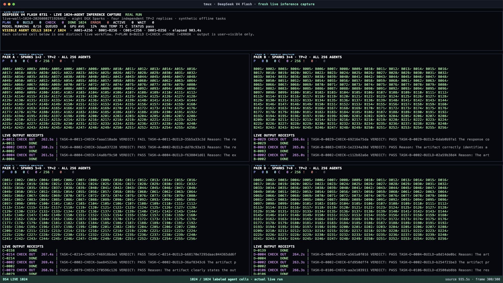
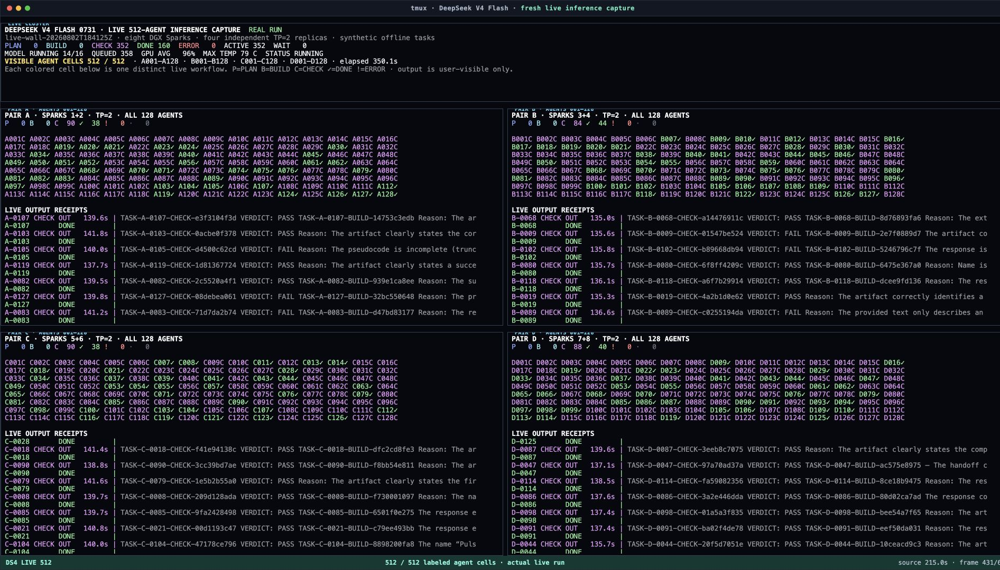

# DeepSeek V4 Flash agent concurrency: live wall and six-run replication

This record contains two different things, and I keep them separate:

1. original 512- and 1,024-workflow runs captured on a real tmux wall; and
2. a later six-run replacement campaign used to test whether the first timing
   comparison held up.

The tmux media shows the original runs. It is not footage of the six-run
replication.

## Six-run replacement campaign

I did not trust the first one-off comparison enough to put it on X as a general
result. Before collecting the replacement data, I froze the order
`512, 1024, 1024, 512, 512, 1024` and kept the model, runner, synthetic task
corpus, four-pair topology, 16-sequence engine ceiling, and safety gates fixed.

The experimental unit is one complete four-pair campaign. Individual agents
inside a campaign are not independent replicates. This is `n=3` per load and a
descriptive replication only; I do not report a confidence interval or
p-value.

### Run-level results

| Run | Load | Completed workflows | Model calls | Workflow median | Active span | Marker findings | Peak C | Minimum available memory |
|---|---:|---:|---:|---:|---:|---:|---:|---:|
| R01 | 512 | 512 / 512 | 1,536 / 1,536 | 373.799 s | 438.905 s | 2 | 82 | 5.988% |
| R02 | 1,024 | 1,024 / 1,024 | 3,072 / 3,072 | 742.065 s | 878.320 s | 3 | 83 | 5.884% |
| R03 | 1,024 | 1,024 / 1,024 | 3,072 / 3,072 | 745.353 s | 876.763 s | 5 | 81 | 6.043% |
| R04 | 512 | 512 / 512 | 1,536 / 1,536 | 377.733 s | 443.005 s | 1 | 81 | 5.902% |
| R05 | 512 | 512 / 512 | 1,536 / 1,536 | 373.914 s | 439.067 s | 1 | 83 | 5.960% |
| R06 | 1,024 | 1,024 / 1,024 | 3,072 / 3,072 | 742.378 s | 877.937 s | 8 | 84 | 5.937% |

Every run passed its workload, collector, before/after probe, runtime-identity,
service-identity, OOM, swap, and thermal-slowdown gates. Across all six runs,
4,608 workflows and 13,824 model calls completed with zero failed workflows.

### Group comparison

| Metric | 512 workflows | 1,024 workflows | Ratio |
|---|---:|---:|---:|
| Median of run-level workflow medians | 373.914 s | 742.378 s | 1.985424x |
| Run-level median range | 373.799–377.733 s | 742.065–745.353 s | — |
| Run-level median sample SD | 2.239 s | 1.815 s | — |
| Run-level median CV | 0.596810% | 0.244165% | — |
| Median active span | 439.067 s | 877.937 s | 1.999551x |
| Median completion-token rate | 218.690 tok/s | 219.247 tok/s | 1.002549x |

Under this fixed saturated contract, doubling the client workflows nearly
doubled workflow duration and active span while measured completion-token rate
stayed nearly flat. The 1,024 runs did not create 1,024 simultaneous decodes:
the four engines ran up to 16 model sequences and queued up to 1,008 requests.

Active span compares event epochs collected across hosts. Observed absolute
clock skew was at most two seconds, so the 1.999551x span ratio should not be
read beyond that timing uncertainty. The workflow-duration result is computed
per workflow from epochs on the same pair runner.

Twenty outputs missed the unique marker gate. All were HTTP 200,
expected-model, nonempty responses; they do not support a perfect
instruction-following or model-quality claim.

### Failure disposition

- One pre-work attempt failed on a Python import before a workload run or model
  request began. It is not an experimental unit.
- A later campaign completed one 512 run, then a live collector SSH probe
  failed during its second run. The frozen gate stopped the runners. I excluded
  that whole campaign, including its clean first run.
- The replacement campaign used LAN control plus a 60-sample continuity soak
  and a new immutable campaign identifier. No run inside it was retried or
  excluded.

The sanitized record is
[`agent-showcase-replication.json`](../data/agent-showcase-replication.json).
Run `python3 scripts/recompute_replication.py` from the repository root to
rebuild both group summaries and ratios from its run-level values.

## Original tmux-wall showcase

I wanted something more honest than a dashboard animation. I wanted to see the
work happen. I started with 512 workflows, doubled it to 1,024, and put every
labeled cell on one tmux wall while the original runs were live. Every workflow
had three serial model-backed stages: `PLAN`, `BUILD`, and `CHECK`.

## The original 1,024-workflow visual run

| Measured result | Value |
|---|---:|
| Agent workflows requested | 1,024 |
| Agent workflows completed | 1,024 |
| Failed workflows | 0 |
| Live model requests completed | 3,072 / 3,072 |
| Maximum live workflows | 1,024 |
| Maximum client requests in flight | 1,024 |
| Maximum model sequences running | 16 |
| Maximum requests waiting in the model queues | 1,008 |
| Event-ledger span | 893.526 seconds |
| Peak GPU temperature | 83 C |
| Thermal-gate failures | 0 / 186 samples |

All 1,024 workflows reached `DONE`. The harness issued all 1,024 first-stage
requests before the engines completed the wave, and the observed client-side
high-water mark reached 1,024 requests in flight.

The queue is the important distinction. The four deployed TP=2 replicas were
configured for four model sequences each, so 16 sequences could decode at
once. The other requests waited inside the model queues. This is 1,024
concurrent agent workflows, not 1,024 simultaneous decoding streams.

## What changed in the original one-off comparison

| Measured result | 512 workflows | 1,024 workflows | Change |
|---|---:|---:|---:|
| Completed workflows | 512 / 512 | 1,024 / 1,024 | 2.00x |
| Completed model requests | 1,536 / 1,536 | 3,072 / 3,072 | 2.00x |
| Max client requests in flight | 512 | 1,024 | 2.00x |
| Max model sequences running | 16 | 16 | unchanged |
| Max model requests waiting | 496 | 1,008 | 2.03x |
| Event-ledger span | 463.975 s | 893.526 s | 1.93x |
| Median TTFT | 134.367 s | 272.317 s | 2.03x |
| Median end-to-end time | 137.940 s | 275.761 s | 2.00x |
| Peak GPU temperature | 81 C | 83 C | +2 C |
| Failed workflows | 0 | 0 | unchanged |

That is what I expected from a saturated fixed-capacity serving profile. The
harness and APIs accepted twice the concurrent application load, but the model
sequence ceiling stayed at 16. Queue depth roughly doubled, median latency
roughly doubled, and the total campaign took 1.93x as long. This is not a
throughput-scaling claim; it is one bounded concurrency and observability run.

## What the wall shows

The five-pane tmux layout contains one cluster overview and four pair panes.
Each pair pane contains 256 individually labeled cells:

- `A001` through `A256`
- `B001` through `B256`
- `C001` through `C256`
- `D001` through `D256`

Cell state changes are driven by the live event ledger:

- `P` — PLAN
- `B` — BUILD
- `C` — CHECK
- `✓` — DONE
- `!` — ERROR
- `·` — waiting to start

The corrected 1,024-agent capture contains 1,857 original live frames. An
automated visibility check found all 1,024 unique labeled cells in every
retained frame. A separate 300-frame edit was validated the same way before
the 60-second social cut was encoded.

Fifteen of the 1,872 raw frames caught tmux between a clear and repaint
operation and did not contain the complete cell set. I excluded those 15
frames. No synthetic or replayed frames were added. A contact-sheet review then
caught five browser screenshots taken before paint completed; I re-rendered
those exact edit frames with a paint-readiness gate before encoding the final
movie.

## The original 512-workflow visual run

The first fresh live run also completed cleanly:

| Measured result | Value |
|---|---:|
| Agent workflows completed | 512 / 512 |
| Failed workflows | 0 |
| Live model requests completed | 1,536 / 1,536 |
| Maximum client requests in flight | 512 |
| Maximum model sequences running | 16 |
| Maximum model requests waiting | 496 |
| Event-ledger span | 463.975 seconds |

That wall used 128 labeled cells per pair. All 512 labels were present in each
of the 665 corrected source frames and each of the 300 selected edit frames.

## Verification boundary

Both original visual campaigns were fresh live inference runs, not replays of
sealed receipts.
Each capture is hash-bound to its run contract, summary, event ledger, and
before/after runtime-identity receipts.

The prompts were synthetic offline tasks. The inference, queueing, model
responses, concurrency, telemetry, and completion receipts were real.

The 1,024-workflow run recorded four task-receipt marker mismatches. The
512-workflow run recorded three. All seven responses were HTTP 200, came from
the expected model, and contained nonempty individually hashed output, but they
did **not** satisfy the unique marker gate. The frozen acceptance contract
reported that finding without failing the workflow.

That distinction defines the claim: “completed workflow” means the harness
received all three expected-model responses and reached its terminal state. It
does not mean every response passed instruction-following or model-quality
evaluation. This showcase does not make either claim.

The sanitized numeric records are in
[`agent-showcase-512.json`](../data/agent-showcase-512.json) and
[`agent-showcase-1024.json`](../data/agent-showcase-1024.json).

## What this does not claim

This is a concurrency and observability demonstration. It is not a speed
record, a quality evaluation, an agent intelligence score, or a claim that
1,024 model sequences decoded simultaneously.

The frozen performance profile elsewhere in this repository uses a different
request contract and remains the comparable throughput reference. I am not
mixing those numbers with this showcase.

## Media integrity

The 1,024-agent X-ready movie is a 60-second, 1920x1080 H.264 edit,
time-compressed 16.412x from the 935.504-second corrected tmux capture. It is
silent by design and is distributed separately from the Git repository.

- Movie SHA-256: `88cf11bc750cdba38a544b402bbae93b6625a6bc36b4f537b637b6b4a94e7faf`
- Corrected source-film SHA-256: `7d3a7414deef74953d35ad28289552981353559cc275f82cf1c44e87fcd4a802`
- 300-frame contact-sheet SHA-256: `6575592393000569d13cbee89ceba3a974bae7b74318f001d6748fb9d384e17f`

The dense contact sheet is retained as a publication QA artifact:
[1,024-agent contact sheet](../media/agent-showcase/1024-agent-contact-sheet.jpg).

For the 512-agent edit:

- Movie SHA-256: `1b3157e4d05bd3fe4b08c66a892d4dbe52c21cd6689cc4587b67c748df0b21d7`
- Corrected source-film SHA-256: `369d0374f3e3ec577af8cff6c7a0552d20523130d2df64d8cd33a54d4fe22806`
- 300-frame contact-sheet SHA-256: `5bc01bb1b0e2cb9bbbdd9969bbfad256abd111b7463d526454893a7954376726`

The raw operational captures remain private because they include live model
output and infrastructure receipts beyond the public disclosure boundary.
